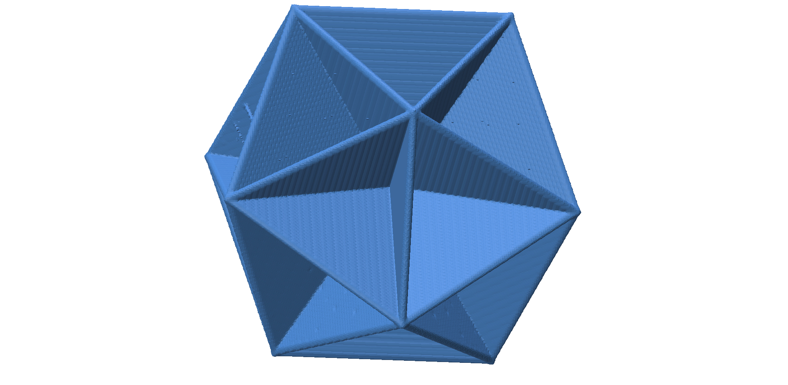

# OpenVDB Level Sets
This is a GUI application trying out diffferent applications for VDB in shape analysis.
Also, in future I hope to make useful visualization of VDB level sets in the UI.

The GUI is based of off Polyscope. This is still very early and WIP.

Currently Implements:
 - Skeleton generation
    - From distance transform divergence

## Skeletonization
### From distance transform divergence
#### Icosahedron skeleton
