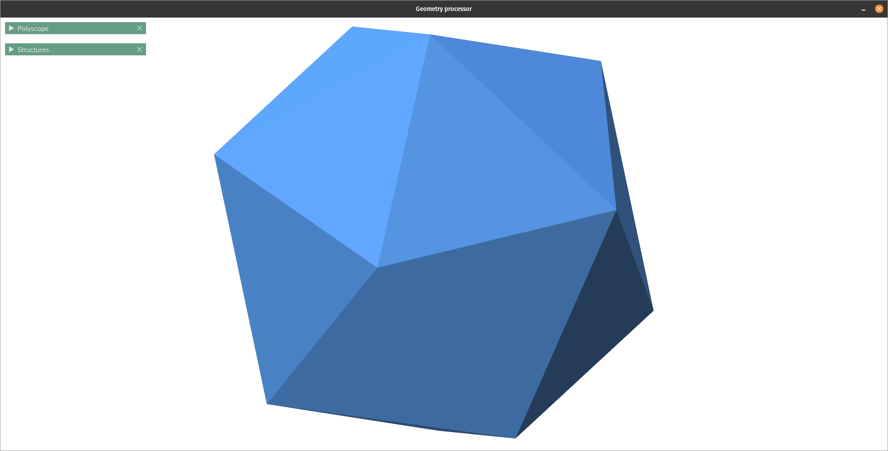
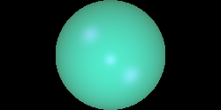

# 1. OpenVDB Level Sets
This is a GUI application trying out diffferent applications for VDB in shape analysis.
Also, in future I hope to make useful visualization of VDB level sets in the UI.

The GUI is based of off Polyscope. This is still very early and WIP.

Currently Implements:
 - Skeleton generation
    - From distance transform divergence

## 1.1. Skeletonization
### 1.1.1. From distance transform divergence
#### 1.1.1.1. Icosahedron skeleton

                Original

                With mean flux scheme NEIGHBOR_26

                With mean flux scheme NEIGHBOR_98

#### 1.1.1.2. Wall street bull

             Original

             Skeleton

# 2. Ray tracing
